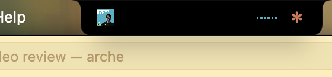
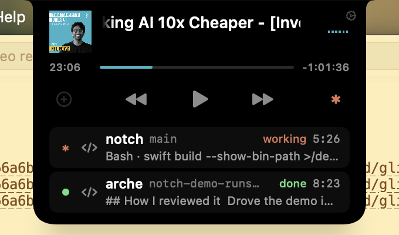
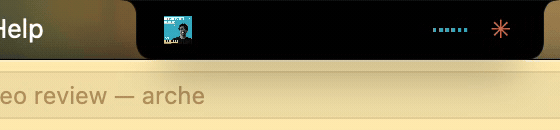

<div align="center">

# Notch

**A Dynamic Island for your Mac's notch, built from scratch in Swift.**


Music · audio-reactive bars · screenshots · your Spotify library · **live Claude Code sessions** — all in the notch, nothing in the Dock or menu bar.

</div>

---

## What it does

<table>
<tr>
<td width="50%">

**Collapsed**: a slim pill hugging the hardware notch. Album art on the left, six audio-reactive bars dancing to whatever's playing on the right. The menu bar underneath stays fully clickable.

</td>
<td>


</td>
</tr>
<tr>
<td>

**Expanded**: hover and the pill morphs into a player with artwork, title, a draggable scrubber, and transport controls. The album art and bars *travel* between the two layouts (`matchedGeometryEffect`), so opening feels like one continuous shape-shift rather than a swap.

</td>
<td>


</td>
</tr>
</table>

### Music

- **Now Playing, from anywhere**: reads the system's Now Playing data (the same source Control Center uses), with a Spotify Apple-Events fallback for macOS versions that lock MediaRemote down. Play/pause, skip, and seek from the notch.
- **Real audio visualization**: a CoreAudio process tap feeds six log-spaced bandpass filters (80 Hz to 7 kHz); each bar is a real frequency band with its own attack/release envelope. Not a canned animation.
- **Podcasts get Spotify's episode controls**: when what's playing is a podcast episode, the transport row becomes `1× · ⟲15 · ⏮ · ⏯ · ⏭ · ⟳15` — tap the speed to cycle 1× → 1.2× → 1.5× → 2×, scrub by 15 s (or 30 s, in Settings), and the save button goes away just as Spotify greys it out for episodes.
- **Long titles scroll**: a podcast title that doesn't fit the player holds still, then glides through Spotify-style and loops — no `…` truncation.

### Screenshots

Watches for new screenshots, pops a toast, optionally copies them straight to the clipboard and routes them into `~/Pictures/Screenshots` (via the system `screencapture` preference, so no folder permission is needed). A one-click cleanup moves every screenshot in the folder to the Trash. Swipe horizontally on the trackpad to switch tabs.


*Take a screenshot → the notch pops a "copied to clipboard" toast; hover it to reveal the recent-screenshots strip.*

### Your Spotify library, in the notch

Connect your Spotify account and the save button answers the question the desktop app answers nowhere else at a glance: *where* is this song saved? Grey ⊕ means nowhere; one click likes it, with a little confetti burst. Green ✓ means it's Liked or playlisted; click and the notch grows downward into a panel listing every playlist that holds it, plus the rest of your playlists so you can add or remove it in place.


*The save button unfolded: the current track is in Liked Songs; the rows below add it to any other playlist with one click.*

### Live Claude Code sessions

Run `claude` in a few terminals and you end up alt-tabbing to see which one is still thinking, which one is waiting on a permission prompt, and which one finished ten minutes ago. Notch puts that in the notch instead.

<table>
<tr>
<td width="50%">

**While a session works**, the CLI's own spinner glyph (`· ✢ ✳ ∗ ✻ ✽`, in Claude orange) sits beside the music bars in the collapsed pill and in the bottom-right corner of the open notch. It cycles while Claude is thinking or running a tool, slows to an amber blink when a session needs you, and folds away once every session is idle or done.

</td>
<td>



</td>
</tr>
<tr>
<td>

**Hover the spinner** and the notch grows downward into a panel with one row per running `claude`: project folder, git branch, where it's hosted (Terminal or VS Code), state, a turn timer, and a one-line detail — the tool it's on right now (`Bash · swift build …`, `Edit · Tabs.swift`, `Grep · pattern`, `Agent · description`), the prompt it's chewing on, or its last reply once it's done. **Click a row** to jump to that session's Terminal tab or VS Code window.

</td>
<td>



</td>
</tr>
</table>

**When a turn ends, Clawd tells you.** Claude Code's pixel mascot runs across the notch with a banner, choreographed by what happened:

| Event | Toast | Clawd |
|---|---|---|
| Turn finished | `project session complete` | sprints the full width, the label painted in behind him |
| Needs a permission | `project needs permission` | trots in, stops beside the label, hops under a blinking `!` |
| Asked you a question | `project has a question` | trots in, rocks side to side under a `?` |
| Turn failed | `project session failed` | trots in, trips, tips over with X eyes, fades |




"Needs you" toasts stay up longer (5.6 s vs 2.7 s) and dismiss themselves early the moment you answer in the terminal. Clicking any toast focuses the session. Events that arrive while Notch isn't running are replayed on launch to rebuild the panel — silently, so a backlog doesn't fire a burst of toasts.

Session states, as the panel shows them: `idle` → `thinking` → `working` (tool call) → `done` / `failed`, with `needs you` for permission prompts and questions, and `compacting` while the context is being compacted. Subagents show up as an `N agents` count on the parent row. `/clear` and `--resume` hand the same process a new session id; the old row is replaced, not duplicated.

Everything happens in the notch: no extra tab, no window, no daemon. Turn it on from Settings → Claude Code; see [Getting started](#getting-started) for what that changes.

### Lives on any edge

The top of the screen is only the default. Click-hold the open notch and drag: it shrinks into a black droplet under the cursor while grey outlined pills appear on every edge it can go to — top, left, and right — with the nearest one lit, showing exactly where it will land. Let go and the droplet glides into that outline and becomes the notch: one object the whole way, no swap or fade. Side-docked, the collapsed notch is a slim upright pill — art at the head, the small audio meter turned to run lengthwise, the Claude spinner at the foot. Hover it and it opens into exactly the same panel as the top notch, just grown out sideways from the edge instead of down from the top: same tabs, same transport, same playlist and sessions fold-outs. The choice persists across launches.

Layouts for every dock and state can be rendered offscreen with `swift test` (PNGs land in `.build/renders/`), so the side-dock design was checked without a cursor in the way.

### Stays out of the way

No Dock icon, no menu bar item. It pins itself across every Space (including full-screen apps), ducks off-screen when Mission Control or App Exposé takes over, and launches at login (toggleable in Settings). Switch to the Screenshots tab and it stays your tab for 30 seconds of inactivity before reverting to Music.

## Why it's interesting under the hood

This is not a menu-bar-app template. A few of the problems it solves:

**Living on every Space.** A normal floating panel vanishes during Space swipes and full-screen transitions. Notch attaches its panel to a private CGS overlay space so it stays glued to the top of the screen through trackpad Space swipes, full-screen apps, and Mission Control, and retracts into the "bezel" with a spring animation when a system overlay needs the screen.

**Real-time audio analysis on a budget.** macOS 14.2's `AudioHardwareCreateProcessTap` provides a public way to tap the system mixdown. The tap runs six direct-form-I biquads per sample on the realtime IO thread, publishes RMS-per-band through a lock-protected snapshot, and a 60 Hz main-thread tick shapes it through per-band dB windows and asymmetric envelope followers. The result: bars that visibly *travel* instead of teleporting.

**Costing nothing at idle.** Every loop in the app is gated or event-driven: the audio tap exists only while music plays, hover detection rides mouse-moved events instead of a poll, UI publishes are skipped when nothing visibly changed, and Spotify updates arrive via distributed notification. Idle CPU is ~0% (down from ~15% in an earlier naive version; see [PR #1](https://github.com/spitfiresb/notch/pull/1) for the hunt).

**A Spotify library mirror that answers instantly.** "Which playlists is this song in?" is one request the Web API won't answer directly, and Spotify's new-app tier blocks most of the classic endpoints anyway. So Notch signs in with Authorization-Code-with-PKCE (no client secret; the redirect lands on a one-shot loopback server), mirrors your playlists into a local index, and keeps the mirror fresh cheaply by diffing each playlist's `snapshot_id`, refetching only what actually changed. Per-track lookups are then instant and work offline; likes and playlist edits apply optimistically and roll back if the write fails.

**First-class trackpad feel.** Two-finger horizontal swipes switch tabs (with haptic ticks), respecting natural-scrolling direction, and a gesture monitor keeps the panel from fighting the system during live Space swipes.

**Watching Claude Code without a daemon.** Claude Code runs a shell command on every lifecycle hook and pipes it JSON. Notch's hook is a ten-line script that stamps the payload with a timestamp and its parent pid and appends it to a spool file; `ClaudeSessionStore` tails the file with a kqueue vnode source (plus a 1 Hz poll as a safety net), replays it on launch, and folds fifteen hook events (`SessionStart`, `UserPromptSubmit`, `PreToolUse`/`PostToolUse`, `PermissionRequest`, `Notification`, `Stop`/`StopFailure`, `SubagentStart`/`Stop`, `PreCompact`/`PostCompact`, `CwdChanged`, `SessionEnd`) into each session's state machine. Sessions are matched to their `claude` process by executable path via `sysctl` — the native binary's `p_comm` is its version string, so name matching doesn't work — and the terminal tab is found by tty (Terminal.app) or window title (VS Code). The hook is registered `async` with a 5 s timeout and always exits 0, so it can never block or fail a session; Claude Code hot-reloads hooks, so flipping the switch takes effect in sessions that are already running.

**Guided permissions.** Instead of "go enable it in System Settings", the onboarding opens the exact privacy pane and floats a small overlay beside it showing what to do — an animated drag-into-the-list for Accessibility, a flip-the-toggle for Automation and Files & Folders — that tracks the Settings window and dismisses itself the moment the grant lands.

## Getting started

```bash
git clone https://github.com/spitfiresb/notch.git
cd notch
./build.sh run
```

Requires **macOS 14.2+** (for the audio tap; everything else degrades gracefully) and Xcode command-line tools. No Xcode project needed; it's a plain Swift Package driven by `build.sh`. See [BUILD.md](BUILD.md) for the full build/run/debug workflow.

On first launch an onboarding window walks through the permissions it wants:

| Permission | Used for | Optional? |
|---|---|---|
| Accessibility | Keeping the notch above other windows and interactive; focusing Claude session windows | **Required** |
| Automation (Spotify) | Track info + controls when MediaRemote is unavailable | Yes (if you don't use Spotify) |
| Files & Folders (Desktop) | The screenshots tab, only if you keep saving screenshots to the Desktop | Yes — the default routes screenshots to `~/Pictures/Screenshots`, which needs no grant |

The audio tap for the dancing bars prompts on its own the first time music plays; deny it and the bars fall back to a synthesized wiggle.

Two things are set up separately from these:

### Spotify account

For the like button and saved-in panel: a standard OAuth login started from the notch's save button or Settings; the token lives in your keychain. Spotify's dev-mode rules mean you bring your own client ID — Settings → Spotify walks through creating the (free) app and pasting the ID in. Now-playing and playback control work without it.

### Claude Code sessions

Settings → Claude Code → **Show live Claude Code sessions**. Turning it on:

1. writes a small script to `~/Library/Application Support/Notch/claude-hook.sh`, and
2. adds a hook entry for each of the events above to `~/.claude/settings.json`, shaped like:

   ```json
   "Stop": [
     { "hooks": [ { "type": "command", "command": "\"…/Notch/claude-hook.sh\"", "timeout": 5, "async": true } ] }
   ]
   ```

Your other hooks are left exactly as they were; turning the switch off removes only entries pointing at Notch's script. Events land in `~/Library/Application Support/Notch/claude-events.jsonl`, which Notch truncates after replaying on launch. Nothing leaves your machine — the hook appends to a local file, and Notch reads it.

Sessions that are already running pick the hooks up without a restart. Terminal.app gets click-to-focus down to the exact tab and VS Code down to the window; any other host still shows up in the panel and is brought to the front on click.

## Architecture

```
Sources/Notch/
├── App/
│   ├── main.swift, AppDelegate.swift  AppKit entry point; hover/overlay watchers
│   └── AppEnvironment.swift           Observable app state, service lifecycle & gating, session toasts
├── Window/
│   ├── NotchPanel.swift               Borderless panel, NotchShape, swipe detection
│   └── SettingsWindowController.swift
├── Views/
│   ├── NotchRootView.swift            The blob: collapsed peek ↔ expanded morph, toasts
│   ├── DancingBars.swift              Six audio-reactive bars
│   ├── OnboardingView.swift           First-run permissions walkthrough
│   ├── SettingsView.swift
│   ├── Music/                         Music tab: transport, scrubber, marquee, save button, saved-in panel
│   ├── Screenshots/                   Screenshots tab: thumbnail strip, copied toast, thumbnail loader
│   ├── Claude/                        Claude spinner + corner, sessions panel, Clawd sprite & toast
│   └── Shared/                        EmptyTab, Haptics
├── PermissionPrompt/                  Guided System Settings overlay (drag-row / toggle variants)
└── Services/
    ├── AudioMeter.swift               CoreAudio process tap → 6-band levels
    ├── NowPlaying.swift               MediaRemote bridge + Spotify fallback
    ├── SpotifyLibrary.swift           Spotify Web API: OAuth (PKCE), library mirror, likes
    ├── ClaudeHooks.swift              Installs/removes the Claude Code hook entries + spool script
    ├── ClaudeSessions.swift           Tails the spool, rebuilds session state, focuses terminals
    ├── ScreenshotWatcher.swift        Screenshot detection, routing & cleanup
    ├── SpaceAttacher.swift            Private CGS space pinning
    ├── TrackpadGestureMonitor.swift   Live-gesture detection
    ├── Permissions.swift              TCC checks & System Settings deep links
    ├── SettingsStore.swift            Persisted preferences
    └── DebugLog.swift                 log-file helper (./build.sh logs)
```

A more detailed map lives in [BUILD.md](BUILD.md).

## Status

Personal project, actively developed. Tested on Apple Silicon, macOS 26. Issues and ideas welcome.
