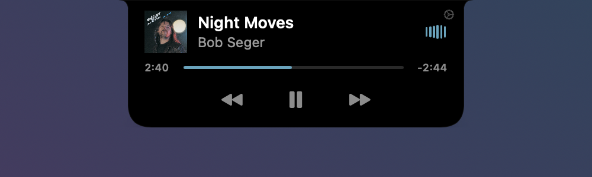
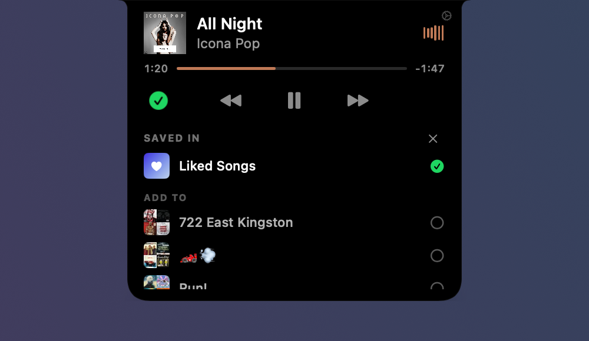

<div align="center">

# Notch

**A Dynamic Island for your Mac's notch, built from scratch in Swift.**


</div>

---

## What it does

<table>
<tr>
<td width="50%">

**Collapsed**: a slim pill hugging the hardware notch. Album art on the left, six audio-reactive bars dancing to whatever's playing on the right. The menu bar underneath stays fully clickable.

</td>
<td>


</td>
</tr>
<tr>
<td>

**Expanded**: hover and the pill morphs into a player with artwork, title, a draggable scrubber, and transport controls. The album art and bars *travel* between the two layouts (`matchedGeometryEffect`), so opening feels like one continuous shape-shift rather than a swap.

</td>
<td>



</td>
</tr>
</table>

- **Now Playing, from anywhere**: reads the system's Now Playing data (the same source Control Center uses), with a Spotify Apple-Events fallback for macOS versions that lock MediaRemote down. Play/pause, skip, and seek from the notch.
- **Real audio visualization**: a CoreAudio process tap feeds six log-spaced bandpass filters (80 Hz to 7 kHz); each bar is a real frequency band with its own attack/release envelope. Not a canned animation.
- **Screenshots tab**: watches for new screenshots, pops a toast, optionally copies them straight to the clipboard and routes them into `~/Pictures/Screenshots` (via the system `screencapture` preference, so no folder permission is needed). A one-click cleanup moves every screenshot in the folder to the Trash. Swipe horizontally on the trackpad to switch tabs.

  

  *Take a screenshot → the notch pops a "copied to clipboard" toast; hover it to reveal the recent-screenshots strip.*
- **Your Spotify library, in the notch**: connect your Spotify account and the save button answers the question the desktop app answers nowhere else at a glance: *where* is this song saved? Grey ⊕ means nowhere; one click likes it, with a little confetti burst. Green ✓ means it's Liked or playlisted; click and the notch grows downward into a panel listing every playlist that holds it, plus the rest of your playlists so you can add or remove it in place.

  

  *The save button unfolded: the current track is in Liked Songs; the rows below add it to any other playlist with one click.*
- **Live Claude Code sessions**: turn it on in Settings and Notch installs hook entries in `~/.claude/settings.json`, so every `claude` running in Terminal.app or VS Code reports what it's doing. While a session works, the CLI's own spinner glyph (`· ✢ ✳ ∗ ✻ ✽`, in Claude orange) sits beside the music bars in the collapsed pill and in the bottom-right corner of the open notch; hover the corner and a panel unfolds with one row per session (project, branch, state, elapsed time) — click a row to jump to its terminal tab. When a turn finishes, needs a permission, asks a question or fails, Clawd (the pixel mascot) sprints across the notch with a toast. Everything happens in the notch: no extra tab, no window.
- **Long titles scroll**: a podcast title that doesn't fit the player holds still, then glides through Spotify-style and loops — no `…` truncation.
- **Stays out of the way**: no Dock icon, no menu bar item. It pins itself across every Space (including full-screen apps), ducks off-screen when Mission Control or App Exposé takes over, and launches at login (toggleable in Settings). Switch to the Screenshots tab and it stays your tab for 30 seconds of inactivity before reverting to Music.

## Why it's interesting under the hood

This is not a menu-bar-app template. A few of the problems it solves:

**Living on every Space.** A normal floating panel vanishes during Space swipes and full-screen transitions. Notch attaches its panel to a private CGS overlay space so it stays glued to the top of the screen through trackpad Space swipes, full-screen apps, and Mission Control, and retracts into the "bezel" with a spring animation when a system overlay needs the screen.

**Real-time audio analysis on a budget.** macOS 14.2's `AudioHardwareCreateProcessTap` provides a public way to tap the system mixdown. The tap runs six direct-form-I biquads per sample on the realtime IO thread, publishes RMS-per-band through a lock-protected snapshot, and a 60 Hz main-thread tick shapes it through per-band dB windows and asymmetric envelope followers. The result: bars that visibly *travel* instead of teleporting.

**Costing nothing at idle.** Every loop in the app is gated or event-driven: the audio tap exists only while music plays, hover detection rides mouse-moved events instead of a poll, UI publishes are skipped when nothing visibly changed, and Spotify updates arrive via distributed notification. Idle CPU is ~0% (down from ~15% in an earlier naive version; see [PR #1](https://github.com/spitfiresb/notch/pull/1) for the hunt).

**A Spotify library mirror that answers instantly.** "Which playlists is this song in?" is one request the Web API won't answer directly, and Spotify's new-app tier blocks most of the classic endpoints anyway. So Notch signs in with Authorization-Code-with-PKCE (no client secret; the redirect lands on a one-shot loopback server), mirrors your playlists into a local index, and keeps the mirror fresh cheaply by diffing each playlist's `snapshot_id`, refetching only what actually changed. Per-track lookups are then instant and work offline; likes and playlist edits apply optimistically and roll back if the write fails.

**First-class trackpad feel.** Two-finger horizontal swipes switch tabs (with haptic ticks), respecting natural-scrolling direction, and a gesture monitor keeps the panel from fighting the system during live Space swipes.

**Watching Claude Code without a daemon.** Claude Code runs a shell command on every lifecycle hook and pipes it JSON. Notch's hook is a ten-line script that stamps the payload with a timestamp and its parent pid and appends it to a spool file; `ClaudeSessionStore` tails the file with a kqueue vnode source (plus a 1 Hz poll as a safety net), replays it on launch, and rebuilds every session's state machine (idle → thinking → tool → waiting → done/failed) from the event stream. Sessions are matched to their `claude` process by executable path via `sysctl` — the native binary's `p_comm` is its version string, so name matching doesn't work — and the terminal tab is found by tty (Terminal.app) or window title (VS Code). Events buffer while Notch isn't running, and the hook never blocks or fails a session.

**Guided permissions.** Instead of "go enable it in System Settings", the onboarding opens the exact privacy pane and floats a small overlay beside it showing what to do — an animated drag-into-the-list for Accessibility, a flip-the-toggle for Automation and Files & Folders — that tracks the Settings window and dismisses itself the moment the grant lands.

## Getting started

```bash
git clone https://github.com/spitfiresb/notch.git
cd notch
./build.sh run
```

Requires **macOS 14.2+** (for the audio tap; everything else degrades gracefully) and Xcode command-line tools. No Xcode project needed; it's a plain Swift Package driven by `build.sh`. See [BUILD.md](BUILD.md) for the full build/run/debug workflow.

On first launch an onboarding window walks through the permissions it wants:

| Permission | Used for | Optional? |
|---|---|---|
| Accessibility | Keeping the notch above other windows and interactive; focusing Claude session windows | **Required** |
| Automation (Spotify) | Track info + controls when MediaRemote is unavailable | Yes (if you don't use Spotify) |
| Files & Folders (Desktop) | The screenshots tab, only if you keep saving screenshots to the Desktop | Yes — the default routes screenshots to `~/Pictures/Screenshots`, which needs no grant |

The audio tap for the dancing bars prompts on its own the first time music plays; deny it and the bars fall back to a synthesized wiggle.

Two things are set up separately from these:

- **Spotify account** (like button, saved-in panel): a standard OAuth login started from the notch's save button or Settings; the token lives in your keychain. Spotify's dev-mode rules mean you bring your own client ID — Settings → Spotify walks through creating the (free) app and pasting the ID in.
- **Claude Code sessions**: Settings → Claude Code → "Show live Claude Code sessions" writes the hook entries into `~/.claude/settings.json` (and removes exactly those entries when switched off). Running sessions pick the hooks up without a restart.

## Architecture

```
Sources/Notch/
├── main.swift, AppDelegate.swift      AppKit entry point; hover/overlay watchers
├── AppEnvironment.swift               Observable app state, service lifecycle & gating
├── Window/
│   ├── NotchPanel.swift               Borderless panel, NotchShape, swipe detection
│   └── SettingsWindowController.swift
├── Views/
│   ├── NotchRootView.swift            The blob: collapsed peek ↔ expanded morph, toasts
│   ├── Tabs.swift                     Music & Screenshots tabs, scrubber, marquee, saved-in panel
│   ├── ClaudeSessionsUI.swift         Claude spinner, sessions panel, Clawd toast
│   ├── OnboardingView.swift           First-run permissions walkthrough
│   └── SettingsView.swift
├── PermissionPrompt/                  Guided System Settings overlay (drag-row / toggle variants)
└── Services/
    ├── AudioMeter.swift               CoreAudio process tap → 6-band levels
    ├── NowPlaying.swift               MediaRemote bridge + Spotify fallback
    ├── SpotifyLibrary.swift           Spotify Web API: OAuth (PKCE), library mirror, likes
    ├── ClaudeHooks.swift              Installs/removes the Claude Code hook entries + spool script
    ├── ClaudeSessions.swift           Tails the spool, rebuilds session state, focuses terminals
    ├── ScreenshotWatcher.swift        Screenshot detection, routing & cleanup
    ├── SpaceAttacher.swift            Private CGS space pinning
    ├── TrackpadGestureMonitor.swift   Live-gesture detection
    ├── Permissions.swift              TCC checks & System Settings deep links
    ├── SettingsStore.swift            Persisted preferences
    └── DebugLog.swift                 log-file helper (./build.sh logs)
```

A more detailed map lives in [BUILD.md](BUILD.md).

## Status

Personal project, actively developed. Tested on Apple Silicon, macOS 26. Issues and ideas welcome.
